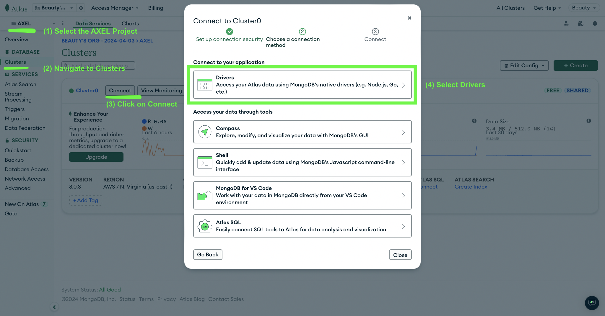

# Pre-requisites

The code in this repository should be able to run on any hardware/operating system that can run Node.js.
During development, members of the team have verified that the code can be run on Mac and Windows operating systems.

To run this code, you should be have some basic familiarity with starting programs from the command line.
See this [link](https://www.freecodecamp.org/news/command-line-for-beginners/) for a basic introduction.

Currently, the code is still in development, so we run and test the code with [Expo Go](https://expo.dev/go)
because it is much easier to get off the ground than using iOS/Android emulators.

# Third-Party Dependencies

Dependent libraries that can be installed on your computer:

1. [Node.js + NPM](https://nodejs.org) for running frontend and backend code
2. (optional) [Docker](https://www.docker.com/get-started/) for running the mail server

-   The easiest method will most likely be [downloading Docker Desktop](https://www.docker.com/products/docker-desktop/)

3. (optional) [Postman](https://www.postman.com/downloads/) for convenient API testing

Dependent libraries that can be installed on your mobile device:

1. [Expo Go](https://expo.dev/go) for testing the app

# Download Instructions

To download the code for this project, open your command line and run

```bash
git clone https://github.com/sohumrao/JIC-4103-Beauty-Consulting-App.git
```

# Installation

Run instructions: what does the user/customer have to do to get the software to execute?
Troubleshooting: what are common errors that occur during installation and what is the corrective action?

## Frontend

To download dependencies for the frontend, run this inside `JIC-4103-Beauty-Consulting-App/`

```bash
cd beauty-consulting-app
npm install
```

Important dependencies include:

-   [React Native](https://reactnative.dev/) - Framework for building native mobile applications using React, allowing us to write cross-platform mobile apps using JavaScript
-   [Expo](https://expo.dev/) - Platform and framework built on top of React Native that provides additional tools and services to simplify mobile app development
-   [React Navigation](https://reactnavigation.org/) - Routing and navigation library for React Native apps to handle moving between different screens
-   [Axios](https://axios-http.com/) - Promise-based HTTP client for making API requests from the frontend to our backend server
-   [Joi](https://joi.dev/) - Schema description language and data validator to ensure data integrity between frontend and backend

## Backend

To download dependencies for the backend, run this inside `JIC-4103-Beauty-Consulting-App/`

```bash
cd server
npm install
```

Important dependencies include:

-   [Express](https://expressjs.com/) - Web framework to handle HTTP requests and route them to the appropriate handlers
-   [Mongoose](https://mongoosejs.com/) - Object modeling tool for MongoDB to define schemas and interact with the database
-   [NodeMailer](https://nodemailer.com/) - Module for sending emails from Node.js applications
-   [WS](https://github.com/websockets/ws) - WebSocket client and server implementation for real-time communication
-   [Faker](https://fakerjs.dev/) - Library for generating fake data to populate the database for testing

## MongoDB Database

If you already have login details to the MongoDB account, you can set up the databse by,

1. Sign in to [MongoDB](https://www.mongodb.com).
2. Make sure you are in the _AXEL_ project (1)
3. Navigate to _Clusters_ (2) and press _Connect_ (3)
4. Under _Connect to your application_ select _Drivers_ (4)
   
5. Follow the instructions on the following page to obtain the <MONGO_URI> for your database

Otherwise, you can [sign up](https://www.mongodb.com/cloud/atlas/register)
for a new account with the free tier of MongoDB Atlas and follow the instructions [here](https://www.mongodb.com/docs/atlas/getting-started/)
to set up an new instance of the MongoDB Database.

## Environment Variables

To keep database/API credentials private and allow for easy configuration changes,
we store many of these details inside environment variables configured inside `*.env` files.
You will need to configure these files appropriately for your app to work as expected.

### Frontend

Inside `beauty-consulting-app/.env` include the following

```
EXPO_PUBLIC_API_URL=<IP Address of the computer hosting the backend server, most likely your laptop>:5050
EXPO_PUBLIC_GEOCODING_API_KEY=<MapQuest API Key>
```

If not already provided, you can obtain the <MapQuest API Key) by signing up for an account [here](https://developer.mapquest.com/account/user/login/sign-up).

### Backend

Inside `server/config.env` include the following

```
MONGO_URI=<MONGO_URI>
EXPO_PUBLIC_GEOCODING_API_KEY=<MapQuest API Key>
EMAIL_ADDRESS=support@axel.com
```

The <MONGO_URI> can be obtained by following the [instructions](<INSTALL_GUIDE#MongoDB Database>) above.
The <MapQuest API Key> is the same as the one used inside `beauty-consulting-app/.env` in the previous section.

## Development Dependencies

To install Prettier, the automatic code formatter, and Husky, a tool used to
automatically run Prettier before commits, run this inside `JIC-4103-Beauty-Consulting-App/`

```bash
npm install
```

# Run Instructions

After installing dependencies and configuring environment variables, you can now run and test your app.
To do so, you will need to

1. Serve the frontend code with Node.js on your computer
2. Run the frontend code with Expo Go on your phone/mobile device
3. Run the backend code with Node.js on your computer

As such, you may need to run code in multiple terminal windows/tabs at once.

## Frontend

After downloading dependencies, run the frontend by executing this inside `JIC-4103-Beauty-Consulting-App/`

```bash
cd beauty-consulting-app
npm start
```

This will display a QR code that you can scan with your mobile device to run the application on that device.
Before scanning the QR code, make sure to press `s` to switch to Expo Go.
The application can be stopped by pressing `Ctrl+C` inside the terminal.

## Backend

After downloading dependencies, run the backend by running this inside `JIC-4103-Beauty-Consulting-App/`

```bash
cd server
npm start
```

Like other commands, the backend server can be stopped by pressing `Ctrl+C` inside the terminal.

## MailPit SMTP Server

After installing Docker, you can host a local email server on your laptop by

1. Startinh Docker by either opening the application
2. Running the following inside `JIC-4103-Beauty-Consulting-App/`

```bash
cd server
docker compose up
```

Like most commands here, the email server can be stopped by pressing `Ctrl+C` inside the terminal

## Generating fake data

After setting up `server/config.env` with the appropriate `MONGO_URI` connection link to the database,
you can automatically populate the database with plausibly fake user data by running this inside `JIC-4103-Beauty-Consulting-App/`

```bash
cd server
node --env-file=config.env populateDB.js
```

# Troubleshooting

While running the app, you will likely encounter some errors. Here are some common issues, symptoms, and solutions.

## Running the frontend

### npm packages were not installed in `JIC-4103-Beauty-Consulting-App/beauty-consulting-app/`:

_Symptoms_:

-   `sh: expo: command not found` when running `npm start`

_Solution_:
Run `npm install` inside `JIC-4103-Beauty-Consulting-App/beauty-consulting-app/`.

### Expo Go is not installed on your phone/mobile device:

_Symptoms_:

-   `App entry not found` or `No usable data found` when scanning the QR code

_Solution_:
Install Expo Go on your phone/mobile device.

### Expo Go is not in on your phone/mobile device:

_Symptoms_:
Expo Go is still not opening after installing

_Solution_:
Make sure you are running Expo in `--go` mode by pressing `s` in your terminal.

## Running the backend

### npm packages were not installed in `JIC-4103-Beauty-Consulting-App/server/`:

_Symptoms_:

-   `sh: nodemon: command not found` when running `npm start`

_Solution_:
Run `npm install` inside `JIC-4103-Beauty-Consulting-App/server/`.

### config.env was no created

_Symptoms_:

-   `node: config.env: not found` when running `npm start`

_Solution_:
Create `JIC-4103-Beauty-Consulting-App/server/config.env` according to the [instructions](<INSTALL_GUIDE#Environment Variables>).

### <MONGO_URI> was not set correctly in config.env

_Symptoms_:

-   `MongoDB connection error` when running `npm start`

_Solution_:
Set <MONGO_URI> in `JIC-4103-Beauty-Consulting-App/server/config.env` according to the [instructions](<INSTALL_GUIDE#Environment Variables>).

## Testing the app

### EXPO_PUBLIC_API_URL was not set correctly:

_Symptoms_:

-   `Request Failed` in the app and `(NOBRIDGE) ERROR  No response received` in the terminal

_Solution_:
Set EXPO_PIUBLIC_API_URL in `JIC-4103-Beauty-Consulting-App/beauty-consulting-app/.env` according to the [instructions](<INSTALL_GUIDE#Environment Variables>).
Make sure the port number at the very end is included and correct (corresponds to the correct port number of the backend server).

### EXPO_PUBLIC_GEOCODING_API_KEY was not set correctly:

_Symptoms_:

-   `Error Retrieving Results` on the directory page
-   `The AppKey submitted with this request is invalid.` in terminal logs

_Solution_:
Set EXPO_PUBLIC_GEOCODING_API_KEY in `JIC-4103-Beauty-Consulting-App/beauty-consulting-app/.env` according to the [instructions](<INSTALL_GUIDE#Environment Variables>).
